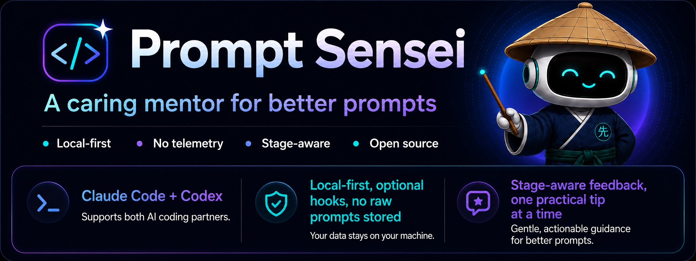

# Prompt Sensei

> Prompting is becoming one of the most important engineering skills in the AI era. Prompt Sensei helps you improve your prompts while teaching you how to improve.

[中文说明](README-zh.md)

[Quickstart](#5-minute-quickstart) · [FAQ](docs/faq.md) · [Privacy](docs/privacy.md) · [Examples](examples/prompt-gallery.md) · [Advanced setup](docs/advanced-setup.md) · [Discussions](https://github.com/chengzhongwei/Prompt-sensei/discussions)

<p align="center">
  
</p>

Prompt Sensei is a quiet, local-first prompt coach for Claude Code and Codex. It gives stage-aware feedback, rewrites rough prompts into better ones, looks back on local history when you ask, and helps you practice one habit at a time.

It is built as a real host-integrated skill, not just a markdown rubric: Prompt Sensei supports hook-based observe comments, opt-in auto-observe hooks, hash-only prompt captures, quiet Stop-hook persistence, and compact-safe continuity where the host exposes the lifecycle events.

No cloud. No telemetry. No leaderboard. No raw prompt archive.

Prompt Sensei's score is a coaching signal, not an objective grade or a guarantee of better output. The real test is whether the improved prompt produces a more useful first draft, fewer clarification turns, safer agent behavior, and easier verification.

---

## Why This Exists

AI coding agents do real work: they edit files, run commands, and make implementation choices. A vague prompt does not just produce a vague answer; it can produce broad edits, hidden assumptions, and extra revision loops.

Prompt Sensei is built around a simple belief:

- Prompting is an engineering skill.
- Engineering skills improve through feedback.
- Feedback should be kind, specific, private, and useful.

It does not treat `fix this test` as a bad prompt. It treats it as an early-stage prompt, then teaches the next step.

---

## 5-Minute Quickstart

Install for Claude Code:

```bash
git clone https://github.com/chengzhongwei/Prompt-sensei ~/.claude/skills/prompt-sensei
(cd ~/.claude/skills/prompt-sensei && npm install && npm run build)
```

Then start live coaching with `/prompt-sensei observe` inside Claude Code. For optional auto-start and privacy settings, run `/prompt-sensei setup`.

Install for Codex:

```bash
git clone https://github.com/chengzhongwei/Prompt-sensei ~/.codex/skills/prompt-sensei
(cd ~/.codex/skills/prompt-sensei && npm install && npm run build)
```

Then ask Codex in natural language: `Use prompt-sensei observe mode.` For optional hook-based auto-start, run `npm run setup-hooks -- auto-observe folder` or use `/prompt-sensei setup` after the skill is loaded.

Start live coaching in Claude Code:

```txt
/prompt-sensei observe
```

Try improving a rough prompt:

```txt
/prompt-sensei improve "fix this test"
```

Example output:

```txt
Prompt Sensei Improve
=====================
Stage:    Exploration
Score:    70 / 100  (Good)

What is missing:
  - failing test name
  - expected behavior
  - actual error output

Improved prompt:
  Help me debug this failing test.

  Test: [test name]
  Expected: [what should happen]
  Actual: [error output or wrong behavior]
  Related file: [file path]

  Return:
  1. Likely root cause
  2. Minimal fix
  3. Test command to verify

Habit to practice next:
  Add expected and actual behavior before asking for a fix.
```

See [examples/prompt-gallery.md](examples/prompt-gallery.md) for more copyable before/after prompts.

---

## Supported Environments

Prompt Sensei works best when the host tool can load the skill directly. It supports both Claude Code and Codex, with host-native hooks for optional auto-observe.

| Invocation style | Environments |
|---|---|
| Direct skill command, e.g. `/prompt-sensei improve "fix this test"` | Claude Code |
| Natural language, e.g. `Use prompt-sensei to improve this prompt...` | Codex |

Cursor and other AI coding tools are not supported yet. `/prompt-sensei observe` is a Claude Code skill command. In Codex, natural-language requests depend on the host agent loading the installed skill. See [advanced setup](docs/advanced-setup.md#host-support) for the Claude Code/Codex hook matrix and trust notes.

---

## Beginner Path

Start with:

```txt
/prompt-sensei observe
```

On first use, Prompt Sensei asks for local storage consent, starts coaching, then offers an optional auto-start choice. The simplest path is manual start; you can still use `/prompt-sensei observe` whenever you want.

For a one-time guided setup, use:

```txt
/prompt-sensei setup
```

Setup covers observe consent, optional host auto-start hooks, and whether to save redacted prompt previews. In Codex, a trust prompt for new or changed command hooks is expected; inspect commands with `/hooks` before enabling them. Advanced details live in [docs/advanced-setup.md](docs/advanced-setup.md).

---

## Commands

```txt
/prompt-sensei [observe|improve|lookback|setup|help]
```

Essential commands:

```txt
/prompt-sensei observe              # start live coaching
/prompt-sensei improve "fix this"   # rewrite a prompt with one teaching note
/prompt-sensei lookback             # analyze selected local prompt history
/prompt-sensei setup                # guided setup
/prompt-sensei help
```

More commands:

```txt
/prompt-sensei stop                 # stop coaching this session
/prompt-sensei report               # show local session trends
/prompt-sensei settings             # show local settings
/prompt-sensei update               # pull latest version and rebuild
/prompt-sensei clear                # delete local Prompt Sensei data
```

In Codex, use natural language equivalents such as `Use prompt-sensei observe mode.` or `Use prompt-sensei to improve this prompt: "fix this test"`.

See [docs/advanced-setup.md](docs/advanced-setup.md) for settings commands, hook setup, Codex examples, and consent scopes.

For direct script checks, see [advanced setup](docs/advanced-setup.md#local-script-checks).

---

## Settings

Prompt Sensei stores local preferences in `~/.prompt-sensei/settings.json`. Defaults are intentionally quiet: auto observe off, redacted prompt previews off, and raw prompts never stored. Use `/prompt-sensei setup` for a guided path or [docs/advanced-setup.md](docs/advanced-setup.md) for the full settings reference.

---

## How It Teaches

Prompt Sensei is stage-aware. A short exploration prompt can be reasonable early, while an execution prompt needs clearer context, boundaries, and verification.

| Stage | Meaning | Example |
|---|---|---|
| Exploration | Still figuring out the problem | `why is this broken` |
| Diagnosis | Have evidence or symptoms | `expected /login, actual /dashboard` |
| Execution | Want implementation or changes | `implement this with these constraints` |
| Verification | Want correctness checks | `find edge cases and test commands` |
| Reusable workflow | Want a repeatable process | `create a code review checklist` |
| Action | Short follow-through directive | `ok commit and push to main` |

The coaching line stays small:

> **[[Sensei: 68/100 · Diagnosis; Tip: add the error message and file path]]()**

Think of the score as prompt readiness for the current stage, not universal prompt quality. A 100/100 prompt can still produce a weak answer if the model lacks domain knowledge, the task is ambiguous outside the prompt, or the rubric does not fit the user's domain.

The report focuses on repeated habits:

```txt
Next habit:      End with the command, test, or edge case that proves the work.
Repeated gap:    add-verification-command (5×)
Average score:   81 / 100  (Good)
```

For the full philosophy, read [docs/philosophy.md](docs/philosophy.md). For scoring details, read [docs/scoring-rubric.md](docs/scoring-rubric.md).

---

## How Do I Know It Helps?

Prompt Sensei does not prove that a prompt is better just because the number went up. It gives a structured coaching signal.

To check whether it helped, compare the original and improved prompt on the same task: fewer clarification turns, fewer surprising edits, a better first answer, and easier verification. For calibration details and the skeptical version, see [FAQ](docs/faq.md).

---

## Lookback

`/prompt-sensei lookback` analyzes selected local Claude Code or Codex history after separate consent. It can inspect one session or recent sessions, generate coaching, and save a Markdown report only after confirmation. Privacy details live in [docs/privacy.md](docs/privacy.md#lookback-privacy), and workflow details live in [docs/skill-flows.md](docs/skill-flows.md#lookback-flow).

---

## Optional Host Hooks

Host hooks provide opt-in auto-start, hash-only background captures, hook-triggered observe comments, and quiet persistence of the final Sensei score line. They are optional and stay quiet unless consent/settings allow them. See [advanced setup](docs/advanced-setup.md#host-support), [Claude example hooks](examples/claude-settings.example.json), and [Codex example hooks](examples/codex-hooks.example.json).

---

## Privacy

Prompt content is sensitive. Prompt Sensei stores nothing until you consent. After consent, it stores local metadata under `~/.prompt-sensei/`; raw prompts are never stored.

Prompt Sensei's local scripts do not send prompt text, scores, reports, or local event data to a service. Lookback may show redacted user prompts to the current AI agent after separate consent.

See [docs/privacy.md](docs/privacy.md) for details.

---

## Contributing

Good first areas:

- realistic prompt improvement examples
- scoring rubric improvements
- redaction rule improvements
- report improvements
- support for other AI coding tools

Please keep changes aligned with the core philosophy: quiet, local-first, encouraging, and privacy-aware.

---

## License

Apache-2.0 — Copyright 2026 Chengzhong Wei
